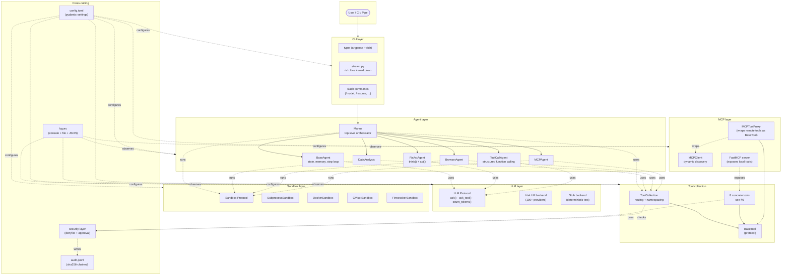

# forgewright — Architecture

> **Status:** v0.1, in active development. **Last updated:** 2026-06-02.
> Source of truth for technical decisions. Pair with [`BUILD_PLAN.md`](./BUILD_PLAN.md) (what to build) and [`docs/RESEARCH.md`](./docs/RESEARCH.md) (why).

This document is for contributors. It describes the layered agent system, the step loop, the memory model, the tool system, the LLM abstraction, the MCP integration, the sandboxing layer, the configuration model, and the extension points. Code samples are illustrative; the implementations live under `src/forgewright/`.

---

## 1. Design principles

1. **Layered composition.** `BaseAgent → ReActAgent → ToolCallAgent → Manus → {sub-agents}`. Each layer adds exactly one capability.
2. **One tool interface.** Every capability a model can invoke — local code, remote MCP, native shell — is a `BaseTool`. The model doesn't know the difference.
3. **Default-deny, opt-in trust.** No tool runs without explicit user approval the first time. The trust registry is the allowlist.
4. **Tamper-evident by default.** Every action lands in a sha256-chained JSONL audit log.
5. **Async-first, sync-friendly.** The agent loop is `asyncio`. Synchronous tools run via `asyncio.to_thread`.
6. **Provider-agnostic.** All LLM calls route through the `LLM` Protocol; the default backend is LiteLLM, the test backend is a stub.

---

## 2. High-level architecture



---

## 3. The layered agent stack

### 3.1 `BaseAgent` — state, memory, step loop

The base class is deliberately small. It owns:

- **`state: AgentState`** — one of `IDLE`, `RUNNING`, `FINISHED`, `ERROR`. Mutated only through `set_state()`.
- **`memory: Memory`** — bounded message history with stuck-loop detection (see §4).
- **`step_count: int`** — incremented on every `step()`. Capped by `max_steps` from config.
- **`on_step: Callable`** — observer hooks for `step_started`, `step_completed`, `tool_called`, `tool_returned`.

```python
class BaseAgent(Protocol):
    state: AgentState
    memory: Memory
    step_count: int
    max_steps: int

    async def step(self) -> StepResult: ...
    async def run(self, prompt: str) -> RunResult: ...
    def cleanup(self) -> None: ...
```

`run()` is a thin loop over `step()` until the state is `FINISHED`, `ERROR`, or `step_count >= max_steps`. Every iteration:

1. Capture the current state of memory.
2. Call `step()` (implemented by the subclass).
3. Append the result to memory.
4. Emit lifecycle events to the audit log.
5. Yield control (so the CLI can render streaming output).

### 3.2 `ReActAgent` — think + act

Adds a **two-phase step**: a `think()` call that produces a plan, and an `act()` call that executes the next action. Useful for models that don't yet support structured function calling (some open-source models, or when the function-calling API is rate-limited).

```python
class ReActAgent(BaseAgent):
    async def think(self) -> Thought: ...   # free-form text
    async def act(self, thought: Thought) -> Action: ...   # tool call or terminate
```

The orchestrator can be configured to fall back from `ToolCallAgent` to `ReActAgent` per-request if the provider doesn't support tool calls.

### 3.3 `ToolCallAgent` — structured function calling

Adds a `parse_tool_calls()` step that extracts structured tool invocations from the model's response. The provider-specific format is normalized to our internal `ToolCall` model:

```python
class ToolCall(BaseModel):
    model_config = ConfigDict(extra="forbid")
    id: str
    name: str = Field(min_length=1, max_length=64)
    args: dict[str, Any]
```

The ToolCall is then dispatched through the `ToolCollection`, which handles namespacing, allowlist enforcement, and audit logging. Multiple tool calls in a single assistant turn are dispatched concurrently via `asyncio.gather`.

### 3.4 `Manus` — the general-purpose agent

Wires together the standard tool set:

```python
class Manus(ToolCallAgent):
    DEFAULT_TOOLS = [BashTool, FileEditorTool, PythonExecuteTool, WebSearchTool,
                     CrawlTool, AskHumanTool, TerminateTool, BrowserUseTool]
    DEFAULT_SUB_AGENTS = [DataAnalysis, BrowserAgent, MCPAgent]
    DEFAULT_LLM = "anthropic:claude-sonnet-4-6"
```

The `Manus` system prompt is loaded from `agent/prompts/manus.md` at startup. It tells the model: which tools exist, the iteration budget, the output format, the safety constraints, and the escalate-to-human pattern.

### 3.5 Sub-agents

Each sub-agent is a `Manus` subclass that:

- Restricts the tool set (e.g. `BrowserAgent` only loads `BrowserUseTool` + `Terminate`).
- Has its own system prompt emphasizing its specialty.
- Inherits the parent's memory and step budget unless overridden.

```python
class DataAnalysis(Manus):
    DEFAULT_TOOLS = [PythonExecuteTool, DataVisualizationTool, FileEditorTool, TerminateTool]
    prompt_file = "data_analysis.md"

class BrowserAgent(Manus):
    DEFAULT_TOOLS = [BrowserUseTool, AskHumanTool, TerminateTool]
    prompt_file = "browser.md"

class MCPAgent(Manus):
    DEFAULT_TOOLS = [MCPProxyTool, FileEditorTool, TerminateTool]
    prompt_file = "mcp.md"
```

The orchestrator (`Manus.run`) routes to a sub-agent when the prompt matches a routing heuristic (e.g. mentions "chart" → `DataAnalysis`; mentions "MCP" or "server" → `MCPAgent`). The routing logic is itself a small LLM call, configurable to deterministic regex if you don't want the extra hop.

---

## 4. Memory and stuck-loop detection

```python
class Memory:
    def __init__(self, max_messages: int = 200, loop_window: int = 6, loop_threshold: int = 3):
        self._buf: deque[ChatMessage] = deque(maxlen=max_messages)
        self._signatures: deque[str] = deque(maxlen=loop_window)
        self._threshold = loop_threshold
        self._on_loop: Callable | None = None

    def append(self, msg: ChatMessage) -> None: ...
    def snapshot(self) -> list[ChatMessage]: ...
    def is_stuck(self) -> bool: ...
    def on_stuck(self, handler: Callable) -> None: ...
```

A tool call is "stuck" when the last `loop_threshold` tool signatures are byte-identical:

```python
def _signature(self, msg: ChatMessage) -> str:
    if msg.tool_calls:
        tc = msg.tool_calls[0]
        return f"{tc.name}|{json.dumps(tc.args, sort_keys=True)}"
    return hashlib.sha256(msg.content.encode()).hexdigest()[:16]
```

When `is_stuck()` returns true, the agent injects a system nudge into the next prompt:

> You appear to be repeating the same action. Step back, restate your goal, and try a different strategy. If you're stuck because a tool is broken, escalate to the user via `ask_human`.

The nudge is removed once a non-repeating tool call is observed.

---

## 5. The LLM abstraction

```python
class LLM(Protocol):
    async def ask(self, messages: list[ChatMessage], **kw) -> ChatMessage: ...
    async def ask_tool(self, messages: list[ChatMessage], tools: list[ToolSpec], **kw) -> AssistantTurn: ...
    async def stream(self, messages: list[ChatMessage], **kw) -> AsyncIterator[str]: ...
    def count_tokens(self, messages: list[ChatMessage]) -> int: ...
    def max_context_tokens(self) -> int: ...
    def supports_tool_calling(self) -> bool: ...
```

`LLM.from_config()` is the factory. It reads `config.toml`, picks a backend, and returns an instance. The default backend is `LiteLLMBackend`, which routes through `litellm.acompletion` and normalizes responses.

### 5.1 The stub backend

Critical for tests and offline demos. The stub:

- Reads a JSONL "script" of `(user_prompt_substring, assistant_response)` pairs.
- Returns the matching response; rotates if multiple match.
- Supports `ask_tool()` via scripted tool-call sequences.
- Counts tokens as `len(text) // 4`.
- Refuses to stream (returns the full response at once).

Tests can write a script, set `provider = "stub"` in the test config, and assert that the agent does the right thing without ever hitting a real LLM.

### 5.2 Retry and rate limits

`LiteLLMBackend` wraps each call in a tenacity retry:

```python
RETRYABLE = (litellm.exceptions.RateLimitError,
             litellm.exceptions.APITimeoutError,
             litellm.exceptions.ServiceUnavailableError,
             ConnectionError)

@retry(
    retry=retry_if_exception_type(RETRYABLE),
    wait=wait_random_exponential(multiplier=1, min=2, max=60),
    stop=stop_after_attempt(7),
    reraise=True,
    before_sleep=_log_retry,
)
async def _call(self, messages, **kw): ...
```

`TokenLimitExceeded` is **never** retried — it's surfaced to the agent, which either compacts the conversation via `/compact` or escalates to the user.

### 5.3 Streaming

`LLM.stream()` is an `AsyncIterator[str]` that yields token deltas. The CLI consumes the stream with `rich.live.Live` (see §10). Non-streaming callers use `ask()` and `ask_tool()` which internally call `stream()` and reassemble.

---

## 6. The tool system

### 6.1 `BaseTool`

```python
class BaseTool(ABC):
    name: str
    description: str
    args_schema: dict[str, Any]            # JSON Schema
    requires: list[Permission] = []         # e.g. ["network", "filesystem.write"]
    returns_image: bool = False
    timeout_s: int = 30
    _call_count: int = 0                   # metrics

    @abstractmethod
    async def _run(self, **kwargs) -> ToolResult: ...

    async def __call__(self, **kwargs) -> ToolResult:
        # Pre-call: approval check, audit log, timeout wrapper
        # _run
        # Post-call: audit log, redaction, metrics
        ...

    def to_openai_tool(self) -> dict: ...   # for tool calling
    def to_anthropic_tool(self) -> dict: ...
    def as_fastmcp_tool(self) -> Callable: ...  # for MCP exposure
```

`ToolResult` is a tagged union:

```python
class ToolResult(BaseModel):
    model_config = ConfigDict(extra="forbid")
    output: str = ""
    error: str | None = None
    system: str | None = None       # side-channel info for the agent
    base64_image: str | None = None  # for browser screenshots
    is_error: bool = False
```

The `output` is what the model sees. `error` and `is_error` let tools fail without poisoning the model context with stack traces. `system` is for tool-level diagnostics the agent can choose to ignore. `base64_image` carries screenshots through the multimodal message format.

### 6.2 `ToolCollection`

```python
class ToolCollection:
    def __init__(self, tools: list[BaseTool], policy: Policy):
        self._tools: dict[str, BaseTool] = {t.name: t for t in tools}
        self._policy = policy

    def add(self, tool: BaseTool) -> None: ...
    def remove(self, name: str) -> None: ...
    def namespaced_names(self) -> list[str]: ...
    def get(self, name: str) -> BaseTool | None: ...
    async def call(self, name: str, **kwargs) -> ToolResult: ...
    def to_provider_specs(self, provider: str) -> list[dict]: ...
```

`call()` is the only entry point the agent uses. It:

1. Resolves the name (with server_id prefix for MCP tools).
2. Asks the policy layer for permission.
3. Wraps the call in a timeout.
4. Emits an audit event.
5. Returns the `ToolResult` (with secrets redacted).

### 6.3 The eight concrete tools

| Tool | Args schema (excerpt) | Notes |
|---|---|---|
| `python_execute` | `{code: str, timeout_s?: int}` | Sandboxed via `Sandbox` Protocol; default Docker |
| `str_replace_editor` | `{command: view\|create\|str_replace\|insert\|undo_edit, path: str, ...}` | Path-confinement check |
| `bash` | `{cmd: str, cwd?: str, timeout_s?: int}` | Persistent async shell; denylist + per-call approval |
| `web_search` | `{query: str, num_results?: int}` | Google → DDG → Baidu → Bing chain |
| `ask_human` | `{question: str}` | Interactive Rich prompt; required for escalation |
| `terminate` | `{reason: str}` | Sets agent state to FINISHED |
| `browser` | `{action: navigate\|click\|type\|screenshot\|extract, ...}` | Playwright persistent context |
| `crawl` | `{url: str, js?: bool}` | Crawl4AI for JS-heavy pages |

Each tool is implemented in its own module under `src/forgewright/tool/`. Each module exports a class that subclasses `BaseTool` and a singleton `instance` for convenience.

### 6.4 MCP proxy

`MCPToolProxy` wraps a remote MCP tool so it looks identical to a local `BaseTool`:

```python
class MCPToolProxy(BaseTool):
    def __init__(self, mcp_tool: Tool, session: ClientSession, server_id: str):
        self._mcp_tool = mcp_tool
        self._session = session
        self._server_id = server_id
        self.name = f"{server_id}__{mcp_tool.name}"   # namespaced
        self.description = mcp_tool.description or ""
        self.args_schema = mcp_tool.inputSchema

    async def _run(self, **kwargs) -> ToolResult:
        result = await self._session.call_tool(self._mcp_tool.name, arguments=kwargs)
        return ToolResult(output="\n".join(c.text for c in result.content if c.type == "text"))
```

The namespacing (`<server_id>__<tool_name>`) prevents one MCP server from shadowing another's tool. The allowlist, audit log, and timeout wrappers are all inherited from `BaseTool`.

---

## 7. The MCP server

`FastMCP` hosts the local tools so external agents can call them. The server lives in `mcp/server.py`:

```python
mcp = FastMCP("forgewright-local", instructions="Local tools for forgewright.")

for tool in (BashTool(), FileEditorTool(), BrowserUseTool(), TerminateTool()):
    mcp.add_tool(tool.as_fastmcp_tool(), name=tool.name)
```

The server can be launched in two modes:

- **stdio** — `forgewright mcp serve` (default). External clients spawn forgewright as a subprocess and pipe JSON-RPC over stdin/stdout.
- **streamable-http** — `forgewright mcp serve --transport streamable-http --port 8000`. Mounts the FastMCP app on a FastAPI instance at `/mcp`.

Authentication for the HTTP transport uses OAuth 2.1 with PKCE and the `resource` parameter (RFC 8707). Tokens missing the `aud` claim are rejected.

---

## 8. Sandboxing

The `Sandbox` Protocol is the contract that every code-execution backend implements:

```python
class Sandbox(Protocol):
    async def run(self, cmd: str, **kw) -> SandboxResult: ...
    async def write(self, path: str, content: str | bytes) -> None: ...
    async def read(self, path: str) -> str: ...
    async def cleanup(self) -> None: ...
    def doctor(self) -> SandboxStatus: ...
```

Four implementations ship in v0.1:

| Backend | When to use | Key flags |
|---|---|---|
| `SubprocessSandbox` | Trusted code, fast iteration | `timeout_s=5`, no FS limits |
| `DockerSandbox` | Default for untrusted code | `mem_limit=512m`, `pids_limit=256`, `network_mode="none"`, `read_only=True`, `cap_drop=[ALL]` |
| `GVisorSandbox` | Stronger isolation on Linux | `runtime="runsc"` |
| `FirecrackerSandbox` | Multi-tenant hostile (v0.2) | microVM with seccomp + cgroups |

`forgewright sandbox doctor` detects which backends are available on the host and writes the choice to `config.toml`. The default is `DockerSandbox`; `GVisorSandbox` is the recommended upgrade.

### Bash tool safety

The Bash tool sits *between* the agent and the shell. It enforces, in order:

1. **Pre-parse.** Tokenize, strip comments, normalize whitespace.
2. **Denylist.** 20 patterns from `security/denylist.py` (see `SECURITY.md` §4). Hard-block on the 9 worst (`rm -rf /`, `curl|sh`, `kill 1`, …); prompt for the rest.
3. **Allowlist check.** If the command's leading binary is in the trusted-commands list (`ls`, `cat`, `grep`, `pytest`, `git status`, …), skip the prompt.
4. **User prompt.** `? Run `rm -rf ./build` [Y/n/a/A/d]`. `a` writes a `forgewright trust` rule for the project; `A` is session-only; `d` denies and writes a deny rule.
5. **Execute.** The persistent shell (`asyncssh`-backed) runs the command, captures stdout/stderr, applies a per-call timeout.
6. **Audit.** sha256-chained entry with the command, exit code, byte counts, duration.

The trust registry is a TOML file under `~/.config/forgewright/trust.toml`. `forgewright trust ls` shows it; `forgewright trust rm <pattern>` revokes an entry.

---

## 9. Configuration

`config.toml` is the primary config. `pydantic-settings` reads it with the following precedence (highest wins):

1. CLI flags (e.g. `--provider anthropic`)
2. Environment variables (`FORGEWRIGHT_*`, `ANTHROPIC_API_KEY`, `OPENAI_API_KEY`, etc.)
3. `~/.config/forgewright/config.toml` (user-level)
4. `./.forgewright.toml` (project-level)
5. Defaults from `forgewright.config.defaults`

The `Settings` class is a Pydantic v2 `BaseSettings` with `extra="forbid"` and a frozen instance:

```python
class Settings(BaseSettings):
    model_config = SettingsConfigDict(
        env_prefix="FORGEWRIGHT_",
        env_nested_delimiter="__",
        toml_file="config.toml",
        extra="forbid",
        frozen=True,
    )
    llm: LLMConfig
    sandbox: SandboxConfig = SandboxConfig()
    tools: ToolsConfig = ToolsConfig()
    mcp: MCPConfig = MCPConfig()
    security: SecurityConfig = SecurityConfig()
```

Thread-safety is provided by `lru_cache(maxsize=1)` around `get_settings()`. The instance is immutable after first load.

Secrets (`api_key`, `auth_token_env`) are resolved through a `SecretStr` wrapper that masks the value in `repr` and refuses to log it.

---

## 10. The CLI and streaming UX

The CLI is a Typer app. Each subcommand is its own module under `cli/`:

```
cli/
├── app.py             # root, shared options
├── main.py            # forgewright build / forgewright (REPL)
├── run_flow.py        # forgewright flow
├── run_mcp.py         # forgewright mcp ...
├── run_mcp_server.py  # forgewright mcp serve
├── init.py            # forgewright init
├── trust.py           # forgewright trust ...
├── audit.py           # forgewright audit ...
├── sandbox.py         # forgewright sandbox ...
└── stream.py          # rich.Live + markdown streaming
```

### Streaming pattern

`cli/stream.py` implements the `rich.live.Live` + markdown streaming pattern (borrowed from aider's `mdstream.py`):

```python
def stream_reply(chunks: AsyncIterator[str], live_window: int = 6) -> None:
    console = Console()
    stable, buf = "", ""
    with Live(console=console, refresh_per_second=20) as live:
        async for ch in chunks:
            buf += ch
            *head, tail = (buf.splitlines() or [""])
            stable = "\n".join(head[:-live_window] + [""])
            buf = "\n".join(head[-live_window:])
            console.print(Markdown(stable), end="")
            live.update(Markdown(buf))
        console.print(Markdown(buf))
```

The "stable" area scrolls into history; the "live" area is the last `live_window=6` lines, repainted at 20 fps. Code blocks render with syntax highlighting via `rich.syntax.Syntax`. Tool calls render as a `Panel` with a status emoji (`→ running`, `✓ done`, `✗ error`).

### Slash commands

Slash commands are dispatched by the REPL before the prompt reaches the agent:

| Command | Effect |
|---|---|
| `/help` | List commands |
| `/clear` | Clear screen, keep session |
| `/exit` | Save session and exit |
| `/resume [id\|last]` | Open the session picker and resume |
| `/model [name]` | Switch model mid-session |
| `/compact` | Compress the conversation history |
| `/add <path>`, `/drop <path>` | Add/remove a file from the agent's read-set |
| `/permissions` | Show the allowlist |
| `/mcp` | Show loaded MCP servers and tools |
| `/sandbox` | Show the active sandbox backend |
| `/status` | Show tokens, cost, current step |
| `/cost` | Show running cost |
| `/doctor` | Run sandbox + provider + permission diagnostics |
| `/init` | Scaffold a `AGENTS.md` for the current project |
| `/memory` | Show the memory file discovery state |

The `Shift+Tab` permission-mode cycle: `default → acceptEdits → plan → auto → dontAsk → bypass → default`. Only `default` and `plan` prompt for tool calls.

---

## 11. Observability

### 11.1 Logging (loguru)

- **Console** — colorized, single-line, with timestamp + level + message. Auto-disables color in non-TTY.
- **File** — `logs/{timestamp}.log`, rotated at 100 MB, retained 14 days, compressed to zip.
- **JSON** — `--log-format json` emits structured JSON to a separate sink for SIEM ingestion.
- **OpenTelemetry** — `opentelemetry-instrumentation-mcp` auto-instruments MCP calls. Set `TRACELOOP_TRACE_CONTENT=false` in production to avoid leaking prompt content into spans.

### 11.2 The audit log

`audit.jsonl` is sha256-chained, one event per line. The schema is locked (see `docs/RESEARCH.md` Appendix A for the full schema). The chain:

```json
{
  "ts": "2026-06-02T11:30:13.481+10:00",
  "session_id": "01HXY...",
  "type": "tool",
  "actor": {"type": "tool", "name": "Bash", "version": "0.1.0"},
  "user_consent": {"mode": "approve-each", "approver": "forest", "scope": "session"},
  "tool": "Bash",
  "args": {"cmd": "rm -rf ./build", "cwd": "..."},
  "result": {"exit": 0, "stdout_sha256": "ab12...", "stderr_sha256": "cd34..."},
  "prev_hash": "f4e1...",
  "hash": "9c0a..."
}
```

`forgewright audit verify` recomputes the chain; `forgewright audit tail` live-tails; `forgewright audit export` converts to CSV/OTel.

### 11.3 Cost tracking

Per-session totals are written to the session file and to a SQLite database (`~/.local/share/forgewright/usage.db`) for cross-session aggregation. `--cost` shows the running cost; the dashboard recipe shows a richer view.

---

## 12. Extension points

### Adding a new tool

1. Create `src/forgewright/tool/my_tool.py` subclassing `BaseTool`.
2. Implement `_run()` and any subclass-specific hooks.
3. Register in `Manus.DEFAULT_TOOLS` (or a sub-agent's).
4. Add a `docs/recipes/<use-case>.md` example.
5. Add tests under `tests/unit/tool/test_my_tool.py`.

### Adding a new LLM provider

1. The provider must be supported by LiteLLM (preferred) or implement a thin wrapper using the provider's native SDK.
2. Add a config entry to `LLMConfig` in `config.py`.
3. Add a `--provider myprovider` test to the CI matrix.

### Adding a new sub-agent

1. Create `src/forgewright/agent/my_agent.py` subclassing `Manus`.
2. Set `DEFAULT_TOOLS` to the minimum needed.
3. Write a system prompt in `agent/prompts/my_agent.md`.
4. Add a routing heuristic in `Manus._route_to_sub_agent()`.

### Adding a new MCP server

1. Run `forgewright mcp install <name>` to fetch from the registry, **or**
2. Hand-edit `~/.config/forgewright/mcp.json` to add the server definition.
3. Run `forgewright mcp trust <server>__<tool>` for each tool you want to allow.
4. The tools will be auto-discovered on next agent run.

### Adding a new sandbox backend

1. Implement the `Sandbox` Protocol in `src/forgewright/sandbox/my_backend.py`.
2. Register in `SandboxConfig.backends`.
3. Add a `doctor()` implementation that reports availability.
4. Document the install requirements.

---

## 13. Lifecycle and cleanup

`Manus.cleanup()` is called on:

- Agent finishing (state = `FINISHED`)
- Agent erroring (state = `ERROR`)
- `Ctrl+C` interrupt
- Process exit (atexit hook)

Cleanup releases:

- Browser contexts (`browser.py` `BrowserUseTool.close()`)
- Persistent shell sessions (`bash.py` `BashTool.close()`)
- MCP client sessions (`mcp/client.py` `MCPClient.disconnect_all()`)
- Docker containers (`sandbox/docker.py` `DockerSandbox.cleanup()`)
- File handles and asyncio tasks
- The audit log writer (flush + close)

Sandbox containers are force-killed on cleanup with a 5s grace period; Docker's `remove=True` flag ensures they're not left orphaned.

---

*Last updated 2026-06-02. See [`BUILD_PLAN.md`](./BUILD_PLAN.md) for the implementation roadmap.*
