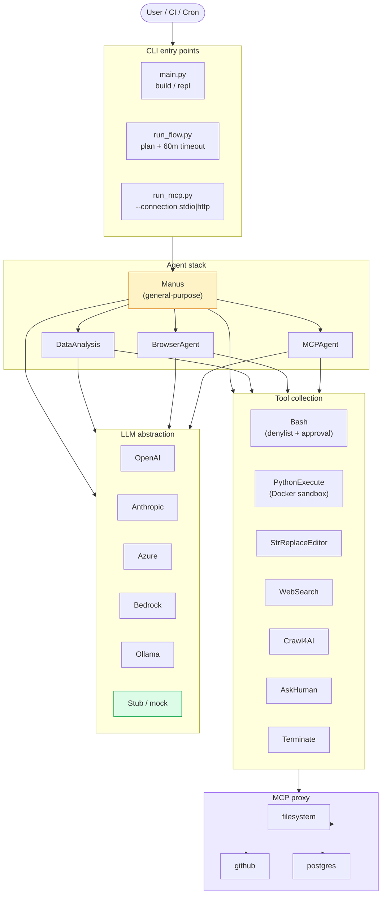

# forgewright

```
   ╔════════════════════════════════════════════════════╗
   ║  ▰▰▰▰▰▰▰▰▰▰▰▰▰▰▰▰▰▰▰▰▰▰▰▰▰▰▰▰▰▰▰▰▰▰▰▰▰▰▰▰▰▰▰▰▰  ║
   ║                                                    ║
   ║       forgewright  ·  v0.1.0                       ║
   ║       ─────────────────────────                   ║
   ║       forge agents. wright code.                   ║
   ║       ready · BYO keys · CLI                       ║
   ║                                                    ║
   ║  ▰▰▰▰▰▰▰▰▰▰▰▰▰▰▰▰▰▰▰▰▰▰▰▰▰▰▰▰▰▰▰▰▰▰▰▰▰▰▰▰▰▰▰▰▰  ║
   ╚════════════════════════════════════════════════════╝
```

**The open-source, CLI-first AI agent framework for builders who'd rather own their stack than rent someone else's.**

[](./LICENSE)
[](https://www.python.org/downloads/)
[](https://pypi.org/project/forgewright/)
[](https://github.com/NaustudentX18/forgewright/actions)
[](https://modelcontextprotocol.io/)
[](https://calver.org/)

> **v0.1.1 (Unreleased) — PWA-ready.** The web chat now installs as a home-screen
> app on iOS and Android, ships a versioned service worker for the app shell,
> and runs over Tailscale HTTPS with one flag. See the [Mobile & PWA](#mobile--pwa)
> section and the full [ROADMAP.md](./ROADMAP.md).

---

## What it is

**forgewright** is a command-line AI agent framework you can run on your laptop, your server, or a Raspberry Pi. It orchestrates multi-step work — browse the web, edit files, run code, call APIs, query databases — by giving a large language model a sandboxed toolbox and letting it loop until the task is done.

- **A real CLI binary** with a streaming REPL, slash-commands, sessions, and `--print` for piping. No GUI, no SaaS, no auth wall.
- **Bring your own keys.** Anthropic, OpenAI, Google, Azure, AWS Bedrock, Ollama, OpenRouter, or a local stub for tests.
- **Sandbox by default.** Python execution runs in a Docker container with hard memory, CPU, PID, and network limits. Every shell command goes through a 20-pattern denylist and per-call approval.
- **MCP-native.** Ships as both an MCP client (discover and call remote tools) and an MCP server (expose Bash, Browser, FileEditor, Terminate to other agents).
- **Free, forever, MIT-licensed.** No telemetry, no token markup, no pro tier.

It's the open-source answer to **Manus AI** and **Lovable** for developers who want the agent on *their* machine, using *their* keys, doing *their* bidding.

**Shipped in v0.1:** layered agent stack (Base → ReAct → ToolCall → Manus + 3 sub-agents), 8 tools, 7 LLM providers, MCP server + client, default-deny sandbox (subprocess → Docker → gVisor → Firecracker), sha256-chained audit log, FastAPI web chat with SSE streaming. **739 unit tests, 0 regressions.**

**Now in v0.1.1:** the web chat installs as a PWA on iOS and Android, with an offline app-shell cache and a Tailscale HTTPS one-shot. See [Mobile & PWA](#mobile--pwa) below.

---

## Why now?

The agent landscape is consolidating fast. **Manus AI** got acquired by Meta and stopped being open. **Lovable**, **Bolt**, **v0**, and **Replit Agent** lock you into their cloud, their deploy, and their pricing — every "free tier" hides a usage cap and a token markup.

The open-source alternatives are catching up — [OpenHands](https://github.com/All-Hands-AI/OpenHands), [OpenManus](https://github.com/FoundationAgents/OpenManus), [smolagents](https://github.com/huggingface/smolagents), [crewAI](https://github.com/crewAIInc/crewAI) — but they all ship as Python libraries. None of them treat the terminal as a peer to a chat UI. None of them make sandboxing and tool authorization secure-by-default. None of them ship a tamper-evident audit log. None of them are Pi-first.

**forgewright** is what we wanted to use. Bring your own keys. Run on your own box. Pipe into your own CI. Ship to your own customers.

---

## Philosophy

Four principles, in order. If a feature conflicts with one, the higher one wins.

1. **Your keys, your machine, your call.** No telemetry. No SaaS middleman. No "trust us." Code is auditable, secrets live in your OS keyring, and the audit log is sha256-chained and verifiable.
2. **Secure by default, open by configuration.** Every dangerous operation needs explicit approval the first time. `forgewright trust` opts *in* to a tool, never *out* of safety. Sandboxing is the default, not an opt-in.
3. **The terminal is a peer.** Streaming, pipe-friendly (`--print --output-format json`), resumable sessions, slash-commands, and a non-blocking interrupt. A REPL, not a chat app.
4. **Composability over completeness.** MCP first-class, BYO model, pluggable sandboxes (subprocess → Docker → gVisor → Firecracker). If you need a feature we don't ship, you can add it in 20 lines.

---

## Demo

```text
$ forgewright build "add JWT auth to the /api routes in app.py"

  ⚒ forgewright v0.1.0  ·  claude-sonnet-4-6  ·  3 tools loaded

  Plan
  ├─ 1. Read app.py and identify routes without auth
  ├─ 2. Add a JWT verification dependency
  ├─ 3. Apply the dependency to each /api route
  └─ 4. Run pytest

  Step 1/4  ·  read app.py
  ▸ str_replace_editor { command: "view", path: "app.py" }
  ✓ 142 lines · 4 routes identified

  Step 2/4  ·  add JWT verification dependency
  ▸ str_replace_editor { command: "create", path: "app/auth.py" }
  ✓ created (38 lines)
  ▸ str_replace_editor { command: "str_replace", path: "app.py", old: "from fastapi import FastAPI", new: "from fastapi import FastAPI, Depends\nfrom app.auth import verify_jwt" }
  ✓ patched

  Step 3/4  ·  wire up routes
  ▸ str_replace_editor { command: "str_replace", path: "app.py" }
  ✓ 4 routes updated with Depends(verify_jwt)

  Step 4/4  ·  verify
  ▸ bash { cmd: "pytest -q" }
  ✓ 11 passed in 1.2s

  Done in 18.4s  ·  6,240 in / 1,512 out  ·  $0.094
  Audit  ·  ~/.local/share/forgewright/sessions/01HXY....json  (4 events, chain verified)
```

That's the shape: a `forgewright build "..."` invocation, a streaming plan, four tool calls, a verification step, and a tamper-evident audit log entry. No web UI, no chat bubble, no waiting on a queue.

---

## Install

```bash
# Recommended: uv (one tool, no venv management)
uv tool install forgewright
```

```bash
# Alternative: pipx
pipx install forgewright
```

```bash
# Homebrew (macOS)
brew install forest/tap/forgewright
```

```bash
# Docker (any platform)
docker run --rm ghcr.io/forest/forgewright --help
```

<!-- asciinema demo will be embedded here after first recording -->

<details>
<summary>More install options</summary>

```bash
# From source
git clone https://github.com/forest/forgewright
cd forgewright && uv sync --all-extras && uv run forgewright

# Windows (Scoop, planned for v0.2)
scoop install forgewright
```

</details>

See [`docs/INSTALL.md`](./docs/INSTALL.md) for the full guide — Windows,
optional extras, `playwright install`, Docker socket troubleshooting, and
more.

---

## Quickstart

```bash
# Configure your provider
forgewright init                            # creates ~/.config/forgewright/config.toml
$EDITOR ~/.config/forgewright/config.toml   # set provider + api_key

# Run a task
forgewright build "summarize the files in ./src"
```

That's the whole shape. The first run walks you through provider, model,
and API key. After that, `forgewright build "..."` is a one-shot and
`forgewright` (no arguments) opens the streaming REPL. The full 5-minute
tour is in [`docs/QUICKSTART.md`](./docs/QUICKSTART.md).

---

## Verify the install

```bash
forgewright --version      # forgewright 0.1.0
forgewright doctor         # python, config, keys, cache — all green?
forgewright sandbox doctor # subprocess / docker / gvisor / firecracker
```

`doctor` reports missing optional bits (Chromium, Docker socket, gVisor)
without failing. `sandbox doctor` recommends the strongest sandbox
backend available on your machine.

---

## What you get

- **A real CLI binary** — `forgewright build "..."` for one-shots,
  `forgewright` for a streaming REPL, `forgewright doctor`,
  `forgewright sandbox doctor`, `forgewright audit verify`, and more.
- **Eight concrete tools out of the box** — `Bash`, `StrReplaceEditor`,
  `PythonExecute`, `WebSearch`, `Browser` (Playwright Chromium),
  `Crawl4AI`, `AskHuman`, `Terminate`. All namespaced, versioned, and
  registered in a single `ToolCollection`.
- **Multi-LLM by default** — Anthropic, OpenAI, Google, Azure, AWS
  Bedrock, Ollama, OpenRouter, plus a deterministic stub for tests.
  Switch providers by editing one config field.
- **Sandboxing that defaults to safe** — `subprocess` for speed, `docker`
  for isolation (`mem_limit=512m`, `pids_limit=256`, `network_mode=none`,
  `read_only=true`, `cap_drop=ALL`), `gvisor` and `firecracker` when
  installed.
- **A 20-pattern dangerous-command denylist** with a small safe-builtin
  allowlist and per-call interactive approval. Three persistence scopes:
  `session`, `repo`, `machine`.
- **A sha256-chained, append-only JSONL audit log.** Every tool call,
  every approval, every secret redaction is recorded. Verify with
  `forgewright audit verify`.
- **MCP, both ways** — ship an MCP server exposing `bash`, `browser`,
  `str_replace_editor`, `terminate`, `ask_human` to other agents, and
  consume any MCP server (filesystem, github, postgres, …) as if its
  tools were local.
- **Resumable sessions, a cost tracker, slash commands, and a
  prompt_toolkit-powered REPL** that pipes cleanly into CI.

---

## Hello, agent

```python
import asyncio
from forgewright import Agent, LLM
from forgewright.tools import Bash, FileEditor, WebSearch

async def main():
    agent = Agent(
        llm=LLM.from_config(),        # reads ~/.config/forgewright/config.toml
        tools=[Bash(), FileEditor(), WebSearch()],
    )
    result = await agent.run("Refactor the auth module to use argon2.")
    print(result)

asyncio.run(main())
```

That's the whole shape. `Agent` is the top of a layered stack:

```
BaseAgent          ← state machine, memory, step loop
   └── ReActAgent         ← think() + act() loop
        └── ToolCallAgent        ← structured function calling
             └── Manus            ← the general-purpose agent
                  ├── DataAnalysis    ← adds chart tools
                  ├── BrowserAgent    ← browser-only
                  └── MCPAgent        ← dedicated MCP transport
```

---

## Why forgewright?

| | forgewright | Manus AI | Lovable | OpenHands | smolagents | crewAI |
|---|:-:|:-:|:-:|:-:|:-:|:-:|
| **Open source, MIT** | ✓ | – | – | ✓ | ✓ | ✓ |
| **CLI-first, pipe-friendly** | ✓ | – | – | partial | – | – |
| **BYO keys, no markup** | ✓ | – | – | ✓ | ✓ | ✓ |
| **Default-deny sandbox** | ✓ | – | – | – | – | – |
| **Tamper-evident audit log** | ✓ | – | – | – | – | – |
| **Per-call approval that learns** | ✓ | – | – | – | – | – |
| **MCP client *and* server** | ✓ | – | – | client | – | – |
| **Multi-agent orchestration** | ✓ | ✓ | – | ✓ | – | ✓ |
| **Resumable sessions** | ✓ | – | – | ✓ | – | – |
| **Streaming JSONL events** | ✓ | – | – | – | – | – |
| **Multi-provider LLM** | ✓ | ✓ | ✓ | ✓ | ✓ | ✓ |
| **Works on a Raspberry Pi** | ✓ | – | – | ✓ | ✓ | ✓ |
| **CalVer releases, signed** | ✓ | n/a | n/a | ✓ | ✓ | ✓ |

---

## Architecture



---

## Bring your own model

| Provider | `provider =` | Notes |
|---|---|---|
| Anthropic | `"anthropic"` | Claude Sonnet 4.6, Opus 4.6, Haiku 4.5 |
| OpenAI | `"openai"` | GPT-5.x, o-series, gpt-oss |
| Google | `"google"` | Gemini 2.5 Pro / Flash |
| Azure OpenAI | `"azure"` | Enterprise deployments |
| AWS Bedrock | `"bedrock"` | Claude, Llama, Mistral on Bedrock |
| Ollama | `"ollama"` | Any local model, `base_url` configurable |
| OpenRouter | `"openai"` | 100+ models, OpenAI-compat `base_url` |
| **Stub** | `"stub"` | No keys needed — for demos and CI |

API keys resolve in this order, **never logged, never committed**: **OS keyring → env var → `secrets.toml`** (chmod 0600). The audit log records *where* a key came from, never the value.

---

## MCP extensions

```toml
# ~/.config/forgewright/config.toml
[mcp.servers.filesystem]
transport = "stdio"
command = "npx"
args = ["-y", "@modelcontextprotocol/server-filesystem", "/home/forest/projects"]

[mcp.servers.github]
transport = "streamable-http"
url = "https://api.github.com/mcp"
auth_token_env = "GITHUB_TOKEN"
```

The agent automatically discovers the server's tools via `ListTools`, wraps each as a local `BaseTool`, namespaces them (`github__create_issue`) to prevent collision, and enforces your allowlist. `forgewright mcp ls` shows what's available; `forgewright mcp trust github__create_issue` allows it; `forgewright mcp install <name>` one-shots a popular server from the [MCP registry](https://registry.modelcontextprotocol.io/).

---

## Recipes

Runnable, end-to-end examples in [`docs/recipes/`](./docs/recipes/):

- **[Refactor a module](./docs/recipes/refactor.md)** — Manus + StrReplaceEditor + Bash + pytest verification
- **[Audit a codebase for CVEs](./docs/recipes/audit.md)** — Crawl4AI + WebSearch + report generation
- **[Build a data dashboard from a CSV](./docs/recipes/dashboard.md)** — DataAnalysis + Vega-Altair
- **[Wire an agent to your Postgres](./docs/recipes/postgres.md)** — MCP + the postgres reference server

Each recipe is a 5-minute read with a copy-pasteable prompt and the expected output.

---

## Mobile & PWA (v0.1.1, shipped)

The web chat is a real Progressive Web App. Add it to your phone's home screen and it runs full-screen with its own icon, splash, and offline shell — no app store, no signing, no APK.

```bash
# On the box running forgewright (e.g. a Pi, a NAS, a VPS)
forgewright web --bind tailscale --tailscale-serve --port 8787
# → https://aiserver.<tailnet>.ts.net:443/forgewright  (auto-TLS via Tailscale)
```

```bash
# On the phone — once
# 1. Open the URL above in Safari / Chrome
# 2. iOS:  Share → Add to Home Screen
#    Android: the browser will prompt "Install app" automatically
# 3. Launch from the home-screen icon — full-screen, no browser chrome
```

What you get:

- **App shell precache** — instant cold start, no flash of white.
- **Last-session offline** — read your most recent chat with the network off.
- **Streaming unchanged** — the service worker explicitly bypasses POST so
  SSE on `/api/sessions/{id}/messages` is bit-identical to the desktop path.
- **Install prompt** — Chromium shows the native install card; iOS gets a
  one-time Share-sheet hint (iOS has no `beforeinstallprompt` event).
- **Stop / cancel** — the red button mid-stream POSTs to the existing abort
  endpoint, server emits `event: error {"message":"aborted"}`, UI flips
  back to Send on click for instant feedback.

Static payload is **54 KB** (HTML + CSS + JS combined) — well under the
55 KB mobile budget. Full setup, troubleshooting, and the "why Tailscale
HTTPS" rationale live in [`docs/MOBILE.md`](./docs/MOBILE.md).

---

## Project status

**v0.1 — Foundation.** Layered agent stack, sandbox, LLM abstraction, CLI, MCP server, PlanningFlow, default-deny tool authorization, sha256-chained audit log. The build plan is in [`BUILD_PLAN.md`](./BUILD_PLAN.md); the research that informed it is in [`docs/RESEARCH.md`](./docs/RESEARCH.md).

**Looking for contributors** in: Playwright tooling, FastMCP integrations, the planning flow, ARM64 build verification, and recipes.

---

## Contributing

```bash
git clone https://github.com/NaustudentX18/forgewright
cd forgewright
uv sync --all-extras
uv run playwright install chromium
uv run pytest -q
```

Open a discussion before large changes. See `CONTRIBUTING.md` (TBD) for style, commit format, and the PR template.

---

## Security

Found a vulnerability? **Please do not file a public issue.** Email `security@forgewright.dev` (TBD). We aim to acknowledge within 48 hours.

- Default-deny sandbox (`forgewright sandbox doctor` picks Docker / gVisor / Firecracker)
- 20-pattern dangerous-command denylist + small safe-builtin allowlist
- Per-call approval with `forgewright trust <pattern> --scope=session|repo|machine`
- sha256-chained JSONL audit log (`forgewright audit verify`)
- Path-confinement for `StrReplaceEditor` (workspace by default)
- LLM API keys never logged, never echoed, never persisted in plain text

Threat model: see [`docs/RESEARCH.md` §7](./docs/RESEARCH.md#7-security--sandboxing).

---

## License

forgewright is released under the **MIT License**. See [`LICENSE`](./LICENSE)
for the full text. The documentation (`docs/`) is dual-licensed under
[CC-BY-4.0](./docs/LICENSE).

- **Code:** MIT
- **Docs:** CC-BY-4.0
- **Citation:** [`CITATION.cff`](./CITATION.cff) (use the
  `preferred-citation` block for v0.1.0 specifically)

---

## Acknowledgments

forgewright stands on the shoulders of giants. With gratitude to:

- **[OpenHands](https://github.com/All-Hands-AI/OpenHands)** — for showing
  what a state-of-the-art open-source agent looks like, and for the
  `BaseAgent` → `ReActAgent` → `ToolCallAgent` → specialised-agent
  pattern this project reuses.
- **[OpenManus](https://github.com/FoundationAgents/OpenManus)** — for the
  prompt design and the layered tool-allowlist ideas.
- **[smolagents](https://github.com/huggingface/smolagents)** — for
  proving that a tiny, opinionated agent library can punch above its
  weight, and for the `code_agent` patterns that influenced
  `PythonExecute`.
- **[crewAI](https://github.com/crewAIInc/crewAI)** — for the
  multi-agent collaboration primitives, even though we diverged in
  v0.1.
- **[LiteLLM](https://github.com/BerriAI/litellm)** — for a single
  interface to every LLM provider worth using.
- **[FastMCP](https://github.com/jlowin/fastmcp)** and the
  **[Model Context Protocol](https://modelcontextprotocol.io/)** spec
  authors — for the protocol that lets agents from different runtimes
  cooperate.
- **[Playwright](https://playwright.dev/)** — for the browser tool that
  finally made headless browsing boring.
- **[Sigstore / cosign](https://github.com/sigstore/cosign)** — for
  making signed releases a 30-second CI step.
- **[Astral / uv](https://github.com/astral-sh/uv)** — for the tool that
  made `uv tool install` a one-liner.
- **[Pydantic](https://docs.pydantic.dev/)**,
  **[Loguru](https://github.com/Delgan/loguru)**,
  **[Rich](https://github.com/Textualize/rich)**,
  **[Typer](https://github.com/fastapi/typer)**,
  **[prompt_toolkit](https://github.com/prompt-toolkit/python-prompt-toolkit)**
  — the unsexy libraries that make a CLI feel like a CLI.
- **The maintainers of every CVE database, package index, and
  documentation page we scraped during research.** You make the
  ecosystem possible.

And to **the early users and contributors** who filed the bug reports,
opened the discussions, and sent the small PRs that made v0.1 actually
shippable. You know who you are.

---

<p align="center"><i>Forge agents. Wright code. In your terminal, with your keys.</i></p>
